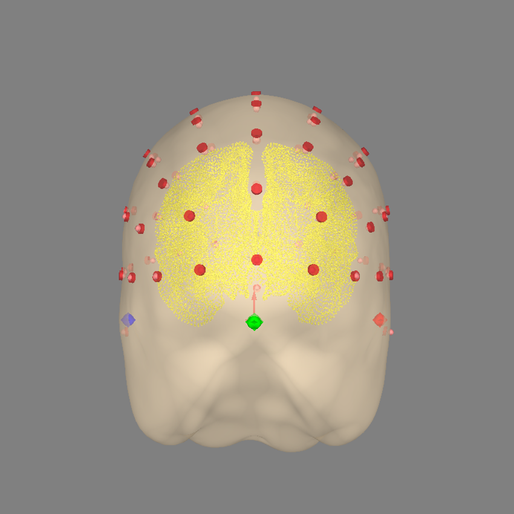
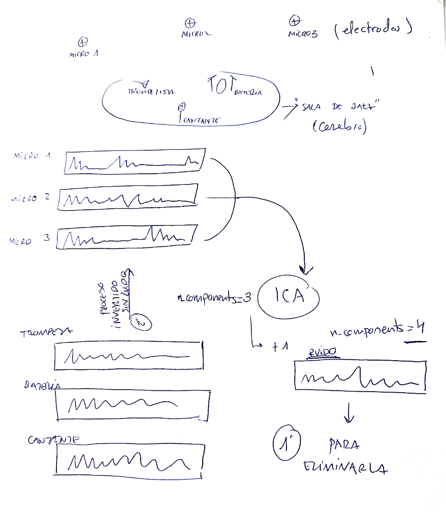

# Rename and reorganizate data

# Import data

# Workflow eeg preprocessing and processing
## Resampling
1. Conversion to 128 Hz
   a. The original frequency sample is converted to 128 hz to meet the *Nyquist frequency*

    ### Nyquist frequency
        
        The Nyquist frequency is half the sampling frequency and represents the maximum frequency that can be accurately represented without errors when digitizing a signal. If you record at 256 Hz, the Nyquist frequency is 128 Hz; when resampling to 128 Hz, it becomes 64 Hz.
        Before reducing the sampling rate, frequencies higher than the new limit (64 Hz) are filtered to avoid distortion (aliasing).
        
        [Wikipedia-Nyquist](https://en.wikipedia.org/wiki/Nyquist_frequency)

    b. Conversion to 128 Hz is common preprocessing step in EEG data analysis, as it allows for better synchronization with other physiological signals and improves the accurancy of frequency analysis. 
    c. Additionally, converting to 128 Hz can help reducing noise in the EEG signal, as it filters out high-frequency noise that may be prsent in the raw data. 

    #### Python Code from mne
    
    ```python
    raw = raw.resample(125)
    ```

2. Bp filter
   a. High Pass Filter: A hpf with a cutoff frequency of 50 HZ is applied to remove low frequency noise 
   b. Low Pass Filter: A lpf with a cutoff frequency of 1 Hz is applied to remove frequencies outside of the range of interest (1-50 hz)

    * Cuando pasa filtros probablemente sobre eso te haga fft y luego te la deshaga!

     ### Python Code from mne: 
     
      ```python
      raw.filter(l_freq=1, h_freq=50)
      ```

3. Montage setup: THe montage is set up to improve performance and create topographic maps


      ### Python Code from mne: 
     ch_names = ['AF3', 'F7', 'F3', 'FC5', 'T7', 'P7', 'O1', 'O2', 'P8', 'T8', 'FC6', 'F4', 'F8', 'AF4']
     
     raw = raw.pick(ch_names)
     montage = mne.channels.make_standard_montage('standard_1020') 
     raw.info.set_montage(montage)
     raw.info.get_montage().get_positions()
     raw.info.get_montage().plot()
     pass

## Pyprep Library
1. Line Noise removal
   a. Bad channel detection: the pyprep library is used to detect and interpolate bad channels
   b. Interpolation of bad channels: Bad channels are interpolated to remove line noise
   c. Re-Referencing: All channels are re-referenced to either the average or specific reference channels
2. PCA and ICA: PCA and ICA are consecutively performed to detect and remove noise and artifacts from the recorder signals
   * Teoría Sala de Jazz. Ponemos components0.9 o 0.99 (porque así de esta forma al no saber cuántos componentes hay (en el ejemplo se ve que hay 3), pues coge el 99 o 90% de los “instrumentos, componentes random del cerebro)
   

   Mne.preprocesingICA à PSD de ICA

## Power Spectral Density (PSD) Calculation
1. Calculation of brain power bands: THe PSD is calculated for each brain power band (Delta, theta, alpha and beta) for each channel and subject
2. Use of welch method: The Welch method is recommended for calculating the PSD as it reduces low frequency noise by cutting the signals into time windows before averaging   

[Welch-Method] (https://en.wikipedia.org/wiki/Welch%27s_method)

[Welch-Method-Python] (https://notebook.community/JoseGuzman/myIPythonNotebooks/SignalProcessing/Welch's%20periodogram)

    El método de Welch divide la señal EEG en segmentos superpuestos, calcula la potencia de cada segmento usando la Transformada de Fourier y luego promedia los resultados para reducir el ruido. Esto muestra cómo se distribuye la energía en diferentes frecuencias. En Python, se implementa fácilmente con scipy.signal.welch.

## Statistical analysis
1. Raw PSD data: Raw PSD DATA can be used for statistical analysis, but it is not recommended forr these studies
2. Calculation of relative brain power bands and mental fatique indexes: Relative power bands and mental fatigue indexes can be calculated if desired
3. Permutation test: A permutation test can be performed, either paired or unpaired depending on the study design and goals
